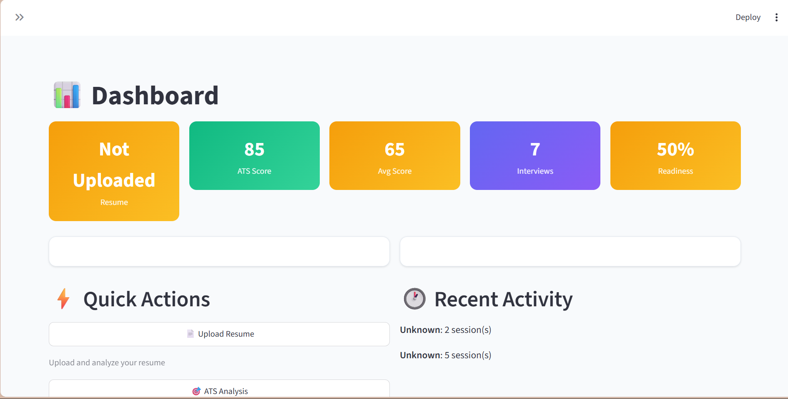
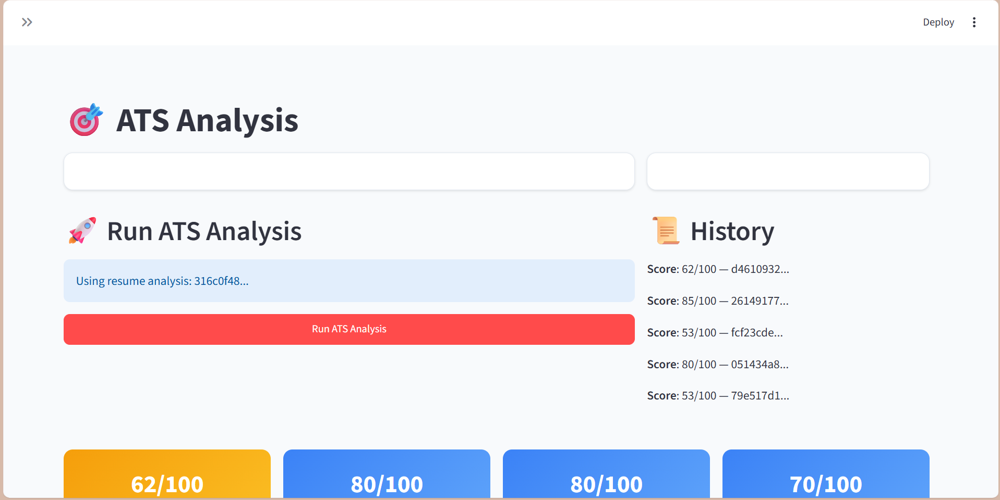
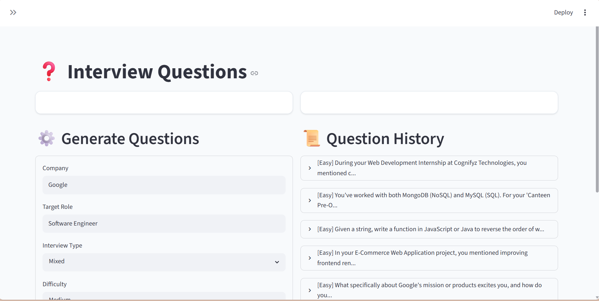
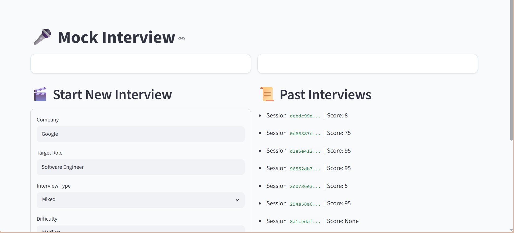
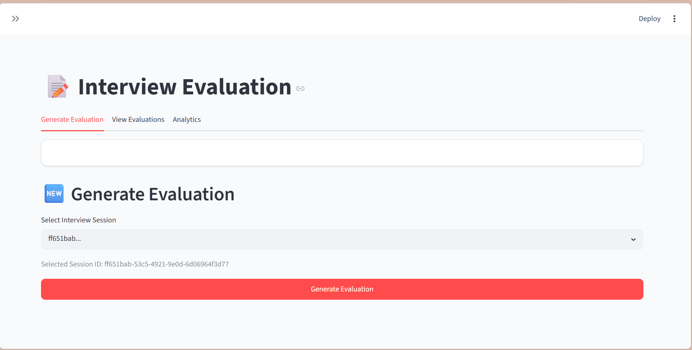
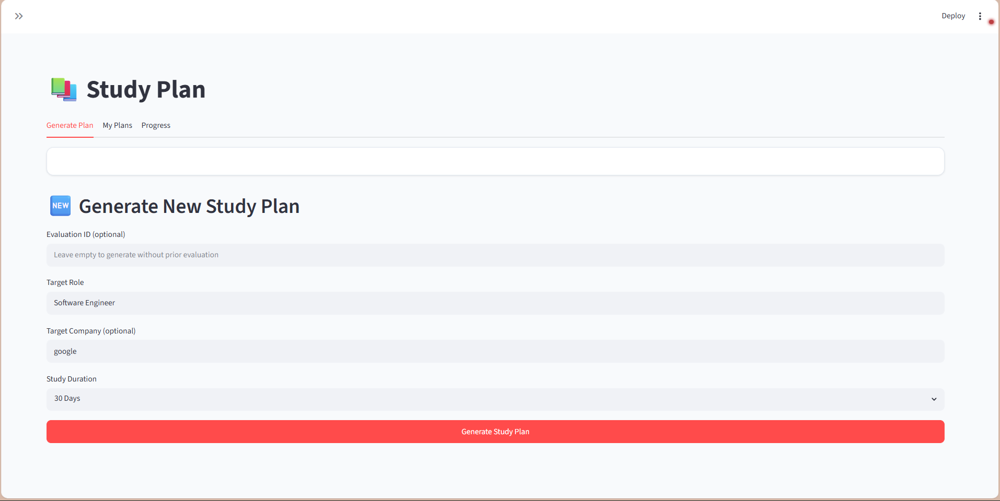
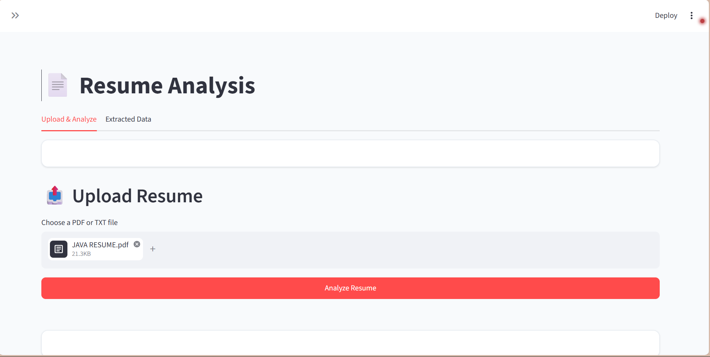

# 🤖 AI Interview Preparation Agent

<div align="center">


**A multi-agent AI system that helps job seekers prepare for interviews through resume analysis, ATS scoring, personalized question generation, live mock interviews, performance evaluation, and adaptive study planning.**

</div>

---

## 🎯 Live Demo

| Resource | URL |
|----------|-----|
| Frontend | `https://your-frontend-url.streamlit.app` |
| Backend API | `https://your-backend-url.onrender.com` |
| Demo Video | `https://youtube.com/watch?v=your-demo-video` |

---

## 📋 Table of Contents

- [Overview](#overview)
- [Live Demo](#-live-demo)
- [Project Highlights](#-project-highlights)
- [Problem Statement](#-problem-statement)
- [Solution](#-solution)
- [Features at a Glance](#-features-at-a-glance)
- [Key Features](#-key-features)
- [System Architecture](#-system-architecture)
- [AI Agent Workflow](#-ai-agent-workflow)
- [Readiness Score](#-readiness-score)
- [Tech Stack](#-tech-stack)
- [Project Workflow](#-project-workflow)
- [Folder Structure](#-folder-structure)
- [Installation](#-installation)
- [API Endpoints](#-api-endpoints)
- [Screenshots](#-screenshots)
- [Performance](#-performance)
- [Testing](#-testing)
- [Deployment](#-deployment)
- [Security](#-security)
- [Roadmap](#-roadmap)
- [Future Improvements](#-future-improvements)
- [FAQ](#-faq)
- [Contributing](#-contributing)
- [Acknowledgements](#-acknowledgements)
- [Author](#-author)

---

## 📋 Overview

AI Interview Preparation Agent is an end-to-end multi-agent AI platform designed to help job seekers prepare for technical and behavioral interviews through resume analysis, ATS scoring, AI-powered mock interviews, interview evaluation, and personalized study plans.

---

## ✨ Project Highlights

- **Six specialized AI agents** orchestrated via Google ADK with structured output schemas
- **Adaptive mock interview** system with real-time difficulty adjustment and category switching
- **Readiness score** that aggregates resume quality, ATS compatibility, interview performance, and study progress
- **Interactive dashboard** with Plotly visualizations including radar charts, gauge charts, and timeline analytics
- **PDF-native resume parsing** using PyMuPDF with Gemini-powered structured data extraction
- **Comprehensive evaluation** across six performance dimensions with hire decision recommendations

---

## 🚀 Project Status

| Status | Details |
|--------|---------|
| Current | Active Development |

Core modules completed:

| Module | Status |
|--------|--------|
| Resume Analysis | ✅ |
| ATS Analysis | ✅ |
| Mock Interview | ✅ |
| Interview Evaluation | ✅ |
| Study Plan | ✅ |
| Dashboard | ✅ |

---

## ❓ Problem Statement

Job seekers face several challenges during interview preparation:

| Challenge | Description |
|-----------|-------------|
| **No objective feedback** | On resume quality and ATS compatibility |
| **Generic interview questions** | That do not target specific roles, companies, or skill gaps |
| **No real-time practice** | Environment that simulates actual interview conditions |
| **No structured evaluation** | Identifying strengths and weaknesses after practice |
| **No personalized study roadmap** | Focused on areas needing improvement |

---

## 💡 Solution

This system addresses each challenge with a dedicated AI agent:

| Agent | Responsibility |
|-------|----------------|
| **Resume Analysis Agent** | Extracts structured data from uploaded resumes |
| **ATS Scoring Agent** | Evaluates the resume against ATS criteria and job role matching |
| **Interview Question Agent** | Generates personalized questions based on resume, target role, and company |
| **Mock Interview Agent** | Conducts a full adaptive interview with intelligent follow-ups |
| **Interview Evaluation Agent** | Scores performance across six dimensions post-interview |
| **Study Plan Agent** | Creates a day-by-day learning roadmap targeting weak areas |

---

## 🚀 Features at a Glance

| Icon | Feature |
|------|---------|
| 📄 | Resume Upload & Parsing |
| 📊 | ATS Scoring & Analysis |
| ❓ | Personalized Question Generation |
| 🎤 | Adaptive Mock Interviews |
| 📝 | Multi-Dimension Evaluation |
| 📚 | Personalized Study Plans |
| 📈 | Analytics Dashboard |

---

## 🎯 Key Features

- **Resume Upload & Parsing** — PDF and TXT support with Gemini-native document analysis
- **Structured Resume Extraction** — name, contact, skills, education, experience, projects, certifications
- **ATS Scoring** — section-level evaluation across 11 categories with job role matching and skill gap analysis
- **Personalized Question Generation** — contextual questions based on resume projects, skills, target company, and role
- **Adaptive Mock Interviews** — real-time difficulty progression, category switching, and intelligent follow-up logic
- **Multi-Dimension Evaluation** — technical, communication, problem-solving, confidence, behavioral, and coding scores
- **Personalized Study Plans** — 7, 15, 30, or 60-day roadmaps with daily tasks, projects, and resources
- **Analytics Dashboard** — readiness score, skill analysis, timeline, interview statistics, and ATS trends
- **Interactive Charts** — radar, bar, pie, line, and gauge visualizations using Plotly
- **Session History** — full interview transcripts and evaluation history

---

## 🏗️ System Architecture

```
                           ┌──────────────────────────┐
                           │     Streamlit Frontend    │
                           │   (9-page application)   │
                           └───────────┬──────────────┘
                                       │ HTTP (requests)
                                       ▼
                           ┌──────────────────────────┐
                           │   FastAPI Backend Server  │
                           │   (CORS-enabled, ASGI)   │
                           └───┬──────┬──────┬──────┬──┘
                               │      │      │      │
                    ┌──────────┘      │      │      └──────────┐
                    ▼                  ▼      ▼                  ▼
            ┌─────────────┐   ┌─────────────┐   ┌─────────────┐
            │  API Routes │   │  CRUD Layer │   │  Services   │
            │  (8 files)  │──▶│  (17 files) │   │  (3 files)  │
            └─────────────┘   └──────┬──────┘   └──────┬──────┘
                                     │                  │
                                     ▼                  ▼
                            ┌──────────────────────────────┐
                            │   SQLite + SQLAlchemy ORM    │
                            │  (18 tables, Pydantic v2)    │
                            └──────────────────────────────┘
                                                │
                ┌───────────────────────────────┼───────────────────────────────┐
                ▼                               ▼                               ▼
    ┌─────────────────────┐         ┌─────────────────────┐         ┌─────────────────────┐
    │  Google ADK Agents  │         │    Gemini 2.5 Flash │         │   Legacy Fallback   │
    │  (6 production)     │────────▶│    (LLM Inference)  │         │   Agents (4 files)   │
    │  + 4 legacy         │         │                     │         │                     │
    └─────────────────────┘         └─────────────────────┘         └─────────────────────┘
```

---

## 🔄 AI Agent Workflow

All agents use Google ADK with Gemini 2.5 Flash, structured output schemas (Pydantic v2), and `InMemorySessionService` for stateless execution.

### Resume Analysis Agent

```
User Uploads Resume (PDF/TXT)
        │
        ▼
  PyMuPDF extracts text
        │
        ▼
  ADK Agent (resume_agent)
  ├── output_schema: ResumeData
  ├── temperature: 0.1
  └── Extracts: full_name, email, phone, skills,
                technical_skills, soft_skills, education,
                experience, projects, certifications, languages
        │
        ▼
  Structured JSON → Database (resume_analyses_adk)
```

- Singleton agent with 5-attempt retry logic via tenacity
- Returns strictly typed Pydantic v2 schema
- Validates every field; uses empty defaults for missing data

### ATS Scoring Agent

```
ResumeData JSON (from Resume Analysis Agent)
        │
        ▼
  ADK Agent (ats_agent)
  ├── output_schema: AtsOutput
  ├── temperature: 0.2
  └── Scoring weightage (100 points):
        Technical Skills (30), Projects (20), Experience (15),
        Education (10), Structure (10), Certifications (5),
        Achievements (5), Grammar & Readability (5)
        │
        ▼
  Structured JSON → Database (ats_scores)
  ├── Section scores with reasons & recommendations
  ├── Job role matching (7 roles, 0-100%)
  ├── Skill gap analysis (missing technologies, languages,
  │   frameworks, cloud, DevOps, databases, soft skills)
  └── Improvement suggestions
```

- Evaluates 11 sections individually with per-section reasoning
- Matches resume against 7 job roles: Python Developer, Backend Developer, AI Engineer, ML Engineer, Data Analyst, Software Engineer, Full Stack Developer
- Categorizes skill gaps into 7 categories for targeted improvement

### Interview Question Agent

```
ResumeData + Parameters (company, role, type, difficulty, count)
        │
        ▼
  ADK Agent (interview_question_agent)
  ├── output_schema: InterviewQuestionList
  ├── temperature: 0.4
  └── Rules:
        - Uses resume projects and skills for personalization
        - Balances question types (HR, Technical, Coding, Behavioral,
          Resume, System Design, Project Discussion)
        - Progressive difficulty (easier → harder)
        - No duplicate questions within a batch
        │
        ▼
  Structured JSON → Database (interview_questions)
  ├── question, expected_answer, hints, follow_up, tags
  └── Supports: Generic, Google, Microsoft, Amazon, Meta, Apple,
                Netflix, Oracle, IBM, Adobe, TCS, Infosys, Wipro,
                Accenture, Capgemini, Deloitte, Cognizant
```

- Each question includes hints, expected answer, follow-up question, and tags
- Generates company-specific questions relevant to the target organization
- Question types adapt based on the selected interview type

### Mock Interview Agent

```
/start ──→ Load ResumeData + ATS + Generated Questions
            │
            ▼
      ADK Agent (interview_agent)
      ├── output_schema: InterviewAgentTurn
      ├── temperature: 0.3
      ├── Adaptive difficulty (↑ every 3-4 correct, ↓ if score < 40)
      ├── Category switching (no consecutive same-category)
      └── Follow-up logic:
            score < 40  → clarification question
            score ≥ 80  → deeper follow-up
            otherwise   → one follow-up, then next question
            │
            ▼   Loop until all questions asked or user ends
      /answer ──→ Submit answer → evaluate → next question
            │
            ▼
      /end ──→ Return transcript summary
```

- Supports 5 interview types: HR, Technical, Coding, Behavioural, Mixed
- Conversation memory via previous turns passed in each prompt
- Score tracking with automatic difficulty adjustment every 3-4 turns
- Company-specific expectations based on supported company list
- Never repeats questions across the session

### Interview Evaluation Agent

```
/end (triggers evaluation)
        │
        ▼
  Load full transcript + ResumeData + ATS scores
        │
        ▼
  ADK Agent (evaluation_agent)
  ├── output_schema: InterviewEvaluationOutput
  ├── Lazy-initialized singleton
  └── Evaluates 6 dimensions (0-100 each):
        Technical, Communication, Problem Solving,
        Confidence, Behavioral, Coding
        │
        ▼
  Structured JSON → Database (interview_evaluations)
  ├── Overall composite score (0-100)
  ├── Strengths & weaknesses lists
  ├── Missed topics & strong topics
  ├── Improvement suggestions
  ├── Hire decision: Strong Hire / Hire / Borderline / Reject
  ├── Difficulty level: Easy / Medium / Hard
  └── Human-readable evaluation summary
```

- Post-interview analysis runs automatically after session end
- Uses the complete conversation transcript for holistic assessment
- Provides both quantitative scores and qualitative feedback
- Fallback implementation ensures robustness when ADK is unavailable

### Study Plan Agent

```
Evaluation + ResumeData + ATS scores
        │
        ▼
  ADK Agent (study_plan_agent)
  ├── output_schema: StudyPlanOutput
  ├── Lazy-initialized singleton
  └── Plan durations:
        7 days  → Rapid Preparation
        15 days → Focused Preparation
        30 days → Comprehensive Preparation
        60 days → Placement Preparation
        │
        ▼
  Structured JSON → Database (study_plans_ai)
  ├── Roadmap overview with weekly focus areas
  ├── Day-by-day tasks (topic, difficulty, time, coding task,
  │   reading task, revision task, goal)
  ├── Weekly goals and milestones with mini-projects
  ├── Coding practice recommendations (platform, difficulty)
  ├── Interview practice recommendations (questions, tips)
  ├── Recommended projects for missing skills
  ├── Recommended certifications for target role
  └── Learning resources (docs, books, videos, courses)
```

- Prioritizes weakest topics first, builds on strengths with advanced material
- Generates a comprehensive learning roadmap with specific daily tasks
- Includes mock interview scheduling recommendations
- Fallback plan generator ensures the feature works without ADK

### Readiness Score

The **Readiness Score** aggregates all agent outputs into a single metric:

```
Readiness = (resume × 0.15) + (ats × 0.20) + (interview × 0.25)
          + (evaluation × 0.25) + (study × 0.15)
```

---

## 🛠️ Tech Stack

### Frontend

| Technology | Purpose |
|-----------|---------|
| Streamlit | Web application framework |
| Plotly | Interactive data visualizations |
| Pandas | Data manipulation |
| Requests | HTTP client for API communication |
| Pillow | Image processing |

### Backend

| Technology | Purpose |
|-----------|---------|
| Python | Runtime |
| FastAPI | REST API framework |
| Uvicorn | ASGI server |
| SQLAlchemy | ORM and database abstraction |
| Pydantic | Data validation and serialization |
| PyMuPDF | PDF text extraction |
| python-multipart | File upload handling |

### AI & Agents

| Technology | Purpose |
|-----------|---------|
| Google ADK | Agent Development Kit for multi-agent orchestration |
| Gemini | LLM for all agent inference |
| google-genai | Gemini SDK client |
| tenacity | Retry logic with exponential backoff |

### Database

| Technology | Purpose |
|-----------|---------|
| SQLite | Embedded database (zero configuration) |
| SQLAlchemy | ORM with 18 model tables |

---

## 🔁 Project Workflow

```mermaid
flowchart TD
    A[User] -->|Upload Resume PDF/TXT| B[FastAPI: /api/resumes/upload]
    B --> C[Extract Text via PyMuPDF]
    C --> D[Resume Analysis ADK Agent]
    D -->|Structured ResumeData| E[SQLite Database]
    D --> F[ATS Scoring ADK Agent]
    F -->|AtsOutput| E
    D --> G[Interview Question ADK Agent]
    G -->|Personalized Questions| E

    H[User] -->|Start Interview| I[FastAPI: /api/interview/start]
    I --> J[Mock Interview ADK Agent]
    J -->|First Question| K[User Answers]
    K -->|/api/interview/answer| L[Agent Evaluates + Scores]
    L -->|Score < 40?| M[Clarification Follow-up]
    L -->|Score >= 80?| N[Deeper Follow-up]
    L -->|Otherwise| O[Next Question]
    M --> K
    N --> K
    O -->|Loop| K
    O -->|All questions done| P[/api/interview/end]
    P --> Q[Interview Evaluation ADK Agent]
    Q -->|6-Dimension Scores| E
    Q --> R[Study Plan ADK Agent]
    R -->|Personalized Roadmap| E

    S[User] -->|View Dashboard| T[FastAPI: /api/dashboard/*]
    T --> U[Aggregate All Data]
    U --> V[Readiness Score]
    V --> W[Streamlit UI: Charts + Stats]

    style A fill:#4CAF50,color:white
    style H fill:#4CAF50,color:white
    style S fill:#4CAF50,color:white
    style D fill:#4285F4,color:white
    style F fill:#4285F4,color:white
    style G fill:#4285F4,color:white
    style J fill:#4285F4,color:white
    style Q fill:#4285F4,color:white
    style R fill:#4285F4,color:white
    style E fill:#FF6F00,color:white
    style W fill:#FF4B4B,color:white
```

> 📷 *A static workflow image can be added at `screenshots/workflow.png` for quick reference.*

---

## 📁 Folder Structure

```
AI-Interview-Preparation-Agent/
├── backend/
│   ├── app/
│   │   ├── api/
│   │   ├── core/
│   │   ├── models/
│   │   ├── schemas/
│   │   ├── crud/
│   │   ├── services/
│   │   │   └── agents/
│   │   └── main.py
│   ├── tests/
│   └── requirements.txt
├── frontend/
│   ├── pages/
│   ├── components/
│   ├── utils/
│   ├── assets/
│   └── app.py
├── tests/
├── .agents/
├── .env.example
├── .gitignore
├── requirements.txt
└── README.md
```

---

## ⚙️ Installation

### Prerequisites

- Python 3.13+
- Google Gemini API key ([Google AI Studio](https://aistudio.google.com/))

### Backend Setup

```bash
# Navigate to backend directory
cd backend
```

#### Windows
```bash
# Create and activate virtual environment
python -m venv venv
.\venv\Scripts\activate

# Install dependencies
pip install -r requirements.txt
```

#### Linux / macOS
```bash
# Create and activate virtual environment
python -m venv venv
source venv/bin/activate

# Install dependencies
pip install -r requirements.txt
```

### Frontend Setup

```bash
# Navigate to frontend directory
cd frontend

# Install dependencies
pip install -r requirements.txt
```

### Environment Variables

Create a `.env` file in the `backend/` directory:

```env
DATABASE_URL=sqlite:///./interview_agent.db
SECRET_KEY=supersecretkeyforinterviewagent
GEMINI_API_KEY=your_gemini_api_key_here
```

| Variable | Description |
|----------|-------------|
| `DATABASE_URL` | SQLite database path (default: `sqlite:///./interview_agent.db`) |
| `SECRET_KEY` | Secret key for authentication |
| `GEMINI_API_KEY` | Your Google Gemini API key from Google AI Studio |

### Run Commands

#### Start Backend Server

```bash
cd backend
```

**Windows:**
```bash
.\venv\Scripts\activate
uvicorn app.main:app --reload --port 8000
```

**Linux / macOS:**
```bash
source venv/bin/activate
uvicorn app.main:app --reload --port 8000
```

#### Start Frontend (in a new terminal)

```bash
cd frontend
streamlit run app.py
```

Access the application at `http://localhost:8501`.

---

## 🔌 API Endpoints

| Module | Description |
|--------|-------------|
| Authentication | User registration and login |
| Resume Analysis | Resume upload and AI analysis |
| ATS Analysis | ATS scoring and recommendations |
| Interview | Mock interview session management |
| Evaluation | Interview evaluation and feedback |
| Study Plan | Personalized study plan generation |
| Dashboard | Analytics and progress tracking |

---

## 📸 Screenshots

<div align="center">

### 🏠 Dashboard


---

### 📄 Resume Analysis


---

### 📊 ATS Analysis


---

### ❓ Interview Questions


---

### 🎤 Mock Interview


---

### 📈 Interview Evaluation


---

### 📚 Study Plan


---

### 📉 Analytics


</div>

---

## ⚡ Performance

| Metric | Description |
|--------|-------------|
| Resume Analysis | ~5–10 seconds per upload (PDF parsing + ADK agent inference) |
| ATS Scoring | ~3–7 seconds per analysis with per-section breakdown |
| Question Generation | ~5–10 seconds for a batch of personalized questions |
| Mock Interview | Real-time responses with <5s per turn evaluation |
| Evaluation | ~5–8 seconds for full transcript analysis |
| Study Plan | ~8–15 seconds for a complete roadmap generation |
| Readiness Score | Instant calculation from cached agent outputs |

> All timings depend on Gemini API response times and network latency.

---

## 🧪 Testing

```bash
# Run backend tests
cd backend
pytest tests/ -v

# Run frontend tests
cd frontend
pytest tests/ -v

# Run all tests from root
pytest -v
```

> Test coverage includes API endpoints, agent workflows, CRUD operations, and schema validation.

---

## 🚢 Deployment

### Render

1. Create a new **Web Service** on [Render](https://render.com/)
2. Set the root directory to `backend/`
3. Build command: `pip install -r requirements.txt`
4. Start command: `uvicorn app.main:app --host 0.0.0.0 --port $PORT`
5. Add environment variables in the Render dashboard

### Railway

1. Create a new project on [Railway](https://railway.app/)
2. Connect your GitHub repository
3. Set the root directory to `backend/`
4. Railway auto-detects Python services from `requirements.txt`
5. Add environment variables in the Railway dashboard

### Streamlit Cloud

1. Push the `frontend/` directory to a separate repository or configure the root
2. Deploy on [Streamlit Community Cloud](https://share.streamlit.io/)
3. Set the main file path to `app.py`
4. Add backend URL as a secret: `API_BASE_URL=https://your-backend-url.com`

### Docker

```dockerfile
# Coming soon — Dockerfile and docker-compose.yml will be added in a future release
```

---

## 🔒 Security

### Environment Variables

All sensitive configuration is managed through environment variables, never hard-coded in source files.

### API Keys

- **GEMINI_API_KEY** — required for all AI agent inference via the Gemini model
- **SECRET_KEY** — used for session and auth token signing
- Never commit actual key values to version control

### .env Best Practices

- A `.env.example` file is provided with placeholder values — use it as a template
- Add `.env` to your `.gitignore` to prevent accidental exposure
- Rotate keys regularly and use different keys for development and production
- In production, use the deployment platform's secret management instead of `.env` files

---

## 🗺️ Roadmap

- [x] Resume upload and structured data extraction
- [x] ATS scoring with job role matching and skill gap analysis
- [x] Personalized interview question generation
- [x] Adaptive mock interview with real-time difficulty adjustment
- [x] Multi-dimension interview evaluation with hire decisions
- [x] Personalized study plan generation
- [x] Analytics dashboard with interactive visualizations
- [ ] JWT-based authentication and OAuth integration
- [ ] PostgreSQL database support
- [ ] Docker containerization with docker-compose
- [ ] CI/CD pipeline with GitHub Actions
- [ ] Voice-based interview mode (speech-to-text / text-to-speech)
- [ ] Multi-language interview support
- [ ] Code execution environment for live coding questions
- [ ] PDF export for study plans and evaluation reports
- [ ] Rate limiting and API caching for production scaling

---

## 🔮 Future Improvements

| Improvement | Description |
|-------------|-------------|
| **JWT-based authentication** | Replace the current mock auth with proper JWT tokens and OAuth integration |
| **PostgreSQL support** | Add production-grade database support alongside SQLite |
| **Multi-language support** | Extend the agents to support interviews in additional languages |
| **Voice-based interviews** | Integrate speech-to-text and text-to-speech for verbal mock interviews |
| **Code execution environment** | Embed a code runner for live coding interview questions |
| **Interview scheduling** | Calendar integration for scheduled mock interview sessions |
| **Export functionality** | PDF export for study plans and evaluation reports |
| **Docker deployment** | Containerized setup with docker-compose for one-command deployment |
| **CI/CD pipeline** | Automated testing and deployment with GitHub Actions |
| **Rate limiting & caching** | API rate limiting and response caching for production scaling |

---

## ❔ FAQ

| Question | Answer |
|----------|--------|
| **Do I need a Google Gemini API key?** | Yes. The agents use Gemini 2.5 Flash for all AI inference. You can get a free key from [Google AI Studio](https://aistudio.google.com/). |
| **Can I use a different LLM?** | Currently the system is tightly integrated with Gemini via Google ADK. LLM-agnostic support is a future consideration. |
| **What file formats are supported for resume upload?** | PDF and TXT formats are supported. PDF parsing uses PyMuPDF with Gemini-powered structured extraction. |
| **Is there a free tier or demo?** | You can run the full system locally for free (you only need a Gemini API key). A hosted demo is planned. |
| **How is the Readiness Score calculated?** | It is a weighted aggregate: Resume (15%), ATS (20%), Interview (25%), Evaluation (25%), Study Plan (15%). |
| **Can I customize the interview questions?** | Yes. You can specify the target company, role, interview type, difficulty level, and number of questions. |

---

## 🤝 Contributing

Contributions are welcome. To contribute:

1. Fork the repository
2. Create a feature branch (`git checkout -b feature/amazing-feature`)
3. Commit your changes (`git commit -m 'Add amazing feature'`)
4. Push to the branch (`git push origin feature/amazing-feature`)
5. Open a Pull Request

Please ensure tests pass and follow the existing code style.

---

## 🙏 Acknowledgements

- **[Google ADK](https://ai.google.dev/adk)** — Agent Development Kit for orchestrating the multi-agent system
- **[Gemini 2.5 Flash](https://ai.google.dev/)** — LLM powering all agent inference with structured output schemas
- **[FastAPI](https://fastapi.tiangolo.com/)** — High-performance backend framework with automatic OpenAPI docs
- **[Streamlit](https://streamlit.io/)** — Rapid frontend development framework for data-driven applications
- **[PyMuPDF](https://pymupdf.readthedocs.io/)** — PDF text extraction for resume parsing
- **[SQLAlchemy](https://www.sqlalchemy.org/)** — ORM and database abstraction layer
- **[Pydantic](https://docs.pydantic.dev/)** — Data validation and structured output enforcement via v2 schemas
- **[Plotly](https://plotly.com/)** — Interactive data visualization library for the analytics dashboard

---

## 👨‍💻 Author

**Manjeet Kumar**

Computer Science & Design Engineering Student

### Connect with me

- GitHub: [https://github.com/Manjeetsingh31](https://github.com/Manjeetsingh31)
- LinkedIn: [https://www.linkedin.com/in/manjeet-kumar-singh-a4b353296/](https://www.linkedin.com/in/manjeet-kumar-singh-a4b353296/)
